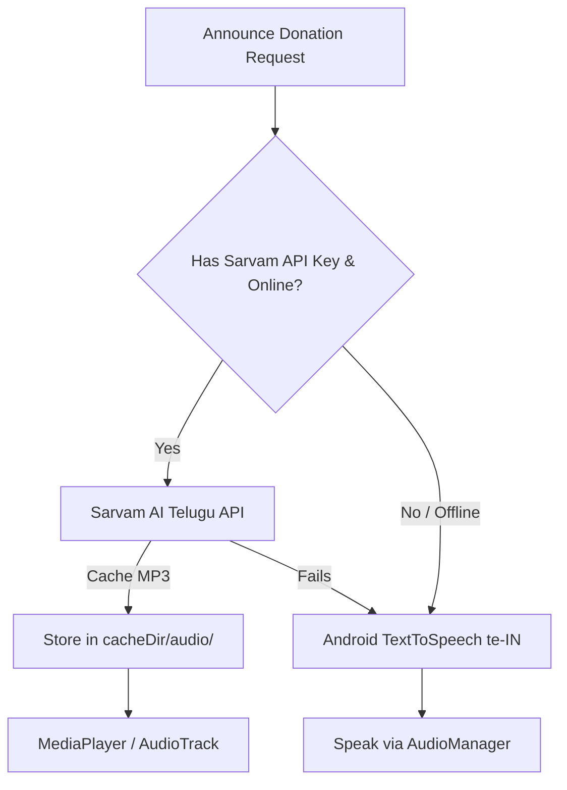

# Telugu TTS & Audio Routing Skill

This skill explains how to build the dual-engine Telugu Text-to-Speech (TTS) system and handle Bluetooth amplifier audio for festival donation announcements.

## 1. Dual-Engine Architecture



---

## 2. Android Native TTS (Free & Offline Default)

Initialize Android's native TTS with the Telugu locale:

```kotlin
class AndroidTtsManager(private val context: Context) : TextToSpeech.OnInitListener {
    private var tts: TextToSpeech? = null
    private var isReady = false

    init {
        tts = TextToSpeech(context, this)
    }

    override fun onInit(status: Int) {
        if (status == TextToSpeech.SUCCESS) {
            val result = tts?.setLanguage(Locale("te", "IN"))
            isReady = (result != TextToSpeech.LANG_MISSING_DATA && result != TextToSpeech.LANG_NOT_SUPPORTED)
        }
    }

    fun speak(text: String, utteranceId: String, onDone: () -> Unit) {
        if (!isReady) return
        val params = Bundle().apply {
            putInt(TextToSpeech.Engine.KEY_PARAM_STREAM, AudioManager.STREAM_MUSIC)
        }
        tts?.speak(text, TextToSpeech.QUEUE_FLUSH, params, utteranceId)
    }
}
```

---

## 3. Sarvam AI Cloud TTS & Local Audio Caching

To preserve the **100% Free Tier** and avoid repeated API calls or Firebase Storage costs:
- **Never upload audio to Firebase Storage.**
- Cache generated audio directly to `context.cacheDir/audio/donation_{id}.mp3`.
- Before calling the Sarvam API, check if the file already exists locally.

```kotlin
suspend fun getOrGenerateAudio(
    donationId: String,
    teluguText: String,
    apiKey: String
): File = withContext(Dispatchers.IO) {
    val audioDir = File(context.cacheDir, "audio").apply { if (!exists()) mkdirs() }
    val cacheFile = File(audioDir, "donation_${donationId}.mp3")

    if (cacheFile.exists()) {
        return@withContext cacheFile
    }

    // Call Sarvam AI REST API
    val response = sarvamApi.textToSpeech(
        apiKey = apiKey,
        body = SarvamTtsRequest(
            inputs = listOf(teluguText),
            target_language_code = "te-IN",
            speaker = "meera" // or "arvind"
        )
    )

    val audioBytes = Base64.decode(response.audios.first(), Base64.DEFAULT)
    cacheFile.writeBytes(audioBytes)
    return@withContext cacheFile
}
```

---

## 4. Audio Focus & Bluetooth Amplifier Output

When playing an announcement over a temple Bluetooth speaker or horn amplifier:
1. Request transient audio focus with ducking so any background music is lowered.
2. Monitor audio route changes (`AudioDeviceCallback`).
3. Abandon audio focus as soon as the announcement completes.

```kotlin
val audioManager = context.getSystemService(Context.AUDIO_SERVICE) as AudioManager
val audioAttributes = AudioAttributes.Builder()
    .setUsage(AudioAttributes.USAGE_ASSISTANCE_ACCESSIBILITY)
    .setContentType(AudioAttributes.CONTENT_TYPE_SPEECH)
    .build()

val focusRequest = AudioFocusRequestCompat.Builder(AudioManagerCompat.AUDIOFOCUS_GAIN_TRANSIENT_MAY_DUCK)
    .setAudioAttributes(audioAttributes)
    .setOnAudioFocusChangeListener { /* Handle focus loss */ }
    .build()
```
