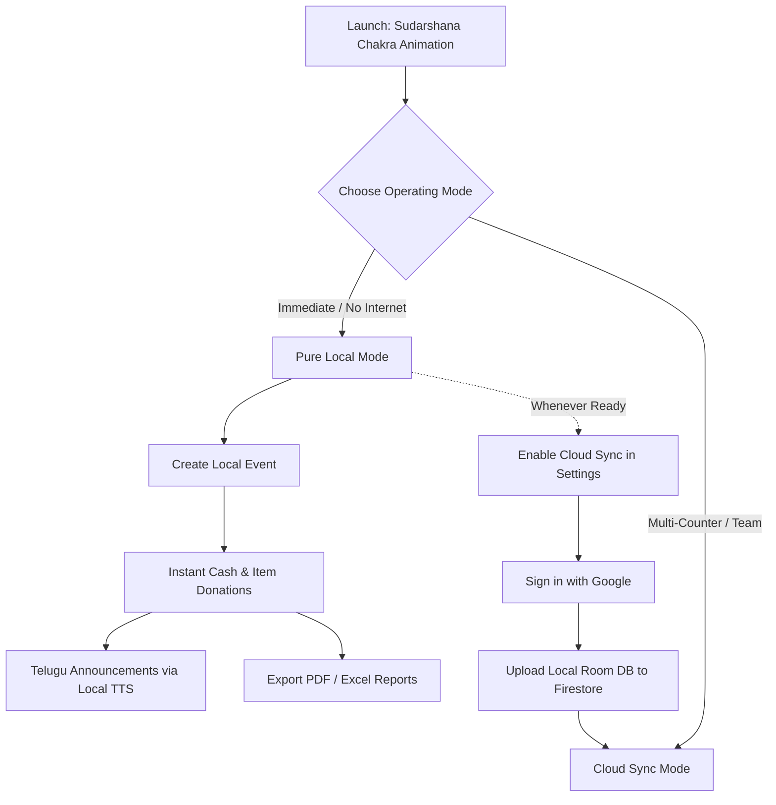

# Festival Donation and Expense App — Master Implementation Plan

## 1. Product Summary

An Android application for multiple temples, festivals, and community events (Vinayaka Chavithi, Sri Rama Navami, Dasara, Hanuman Jayanthi, Temple Renovation Funds, etc.).

Users can:

- Create or join event profiles
- Add cash and non-cash donations (Rice, Sarees, Deity Sponsorship, Flowers, Services)
- Announce donations through the phone speaker or Bluetooth amplifier horn speakers
- Track expenses and manage receipts
- View real-time balances and totals
- Work 100% offline out-of-the-box on first launch with zero barrier
- Synchronize later across multiple devices via Cloud Firestore (optional)
- Export reports (PDF, Excel, WhatsApp summary)
- Use Telugu and English app interfaces
- Generate natural Telugu donation announcements

The first version prioritizes rock-solid reliability, fluid 60/120 FPS performance, zero-jank offline entry, and simplicity over complicated enterprise features.

---

## 2. Technology & Operating Principles

- **Platform**: Native Android
- **Language**: Kotlin 2.0+
- **UI Toolkit**: Jetpack Compose (Material 3)
- **Architecture**: MVVM / MVI with Clean Architecture (`data`, `domain`, `presentation`)
- **Persistence**: Room Database (SQLite) — the single source of truth for the UI
- **Reactive Streams**: Kotlin Coroutines & `StateFlow`
- **Background Work**: Jetpack WorkManager for background delta-sync
- **Authentication**: Firebase Authentication with Google Sign-In (optional for cloud sync)
- **Cloud Database**: Cloud Firestore (Spark Free Tier)
- **Audio Output**: Android Native `AudioManager` with `AudioFocusRequestCompat` (Bluetooth amplifier/speaker routing)
- **Text-to-Speech**:
  - Offline / Default: Android Native `TextToSpeech` (`Locale("te", "IN")`) — 100% free, zero network dependency
  - Cloud / Natural: Sarvam AI Telugu REST API (configurable API key stored in encrypted preferences / Firestore)
- **Audio Storage**: Strictly local device caching (`context.cacheDir/audio/`). Zero audio uploaded to cloud storage to stay 100% on the Free Tier.
- **Simplicity**: Avoid analytics, unnecessary logging, and complicated microservices.

---

## 3. App Launch & Temple Visual Identity

### Visual Identity & Color Tokens
```kotlin
val DeepMaroon = Color(0xFF4A0E17)    // Sandalwood / Sacred Maroon (Primary Dark)
val TempleSaffron = Color(0xFFE65100) // Vibrant Temple Saffron (Primary Light)
val TempleGold = Color(0xFFFFD700)    // Sacred Gold (Accent / Highlights)
val DivineAmber = Color(0xFFFFA000)   // Secondary Accent
val WarmIvory = Color(0xFFFFFDF7)     // Surface Light
val SacredCharcoal = Color(0xFF1A120B)// Surface Dark
```

### Launch Screen (Vishnu Sudarshana Chakra Animation)
- **Mandatory**: On app cold launch, display a lightweight, vector-rendered spinning **Vishnu Sudarshana Chakra**.
- **Duration**: Maximum **1.2 to 1.5 seconds**. Snappy and responsive. Must never delay an organizer waiting to enter donations at a festival counter.
- **Animation**: Smooth continuous rotation easing (`Animatable` rotationZ 0° to 360°) with a subtle radiant divine aura/glow.
- **Transition**: Immediately and smoothly transitions into the Event Dashboard or Event Selector.

---

## 4. First-Launch Flow & Operating Modes



### Pure Local Mode (Zero Barrier Out-of-the-Box)
- The app works 100% offline immediately upon first install.
- No mandatory login, no Firebase setup, and no internet required on first launch.
- SQLite / Room DB stores all events, donations, expenses, and settings locally.
- Full reporting (PDF/CSV/WhatsApp) and announcements work completely offline.

### Cloud Sync Mode (Multi-Device Team Mode)
- Enabled on-demand when multiple collectors or pandal counters need live synchronized totals.
- Authentication via Google Sign-In.
- Global Head creates or links a Cloud Event and generates an **Event QR Code / Share Code**.
- Collectors scan the QR code to join the event with role-based permissions.
- WorkManager automatically synchronizes local records with Cloud Firestore in the background.

---

## 5. Event Profiles

Each festival or temple activity is a separate event profile.

Examples:

- Vinayaka Chavithi 2026
- Sri Rama Navami 2026
- Temple Renovation Fund
- Hanuman Jayanthi

Each event contains:

- Event name
- Temple or organization name
- Location
- Event dates
- Default announcement language
- Members
- Roles
- Donation categories
- Expense categories
- Total donations
- Total expenses
- Balance
- Event QR code
- Active or closed status

Users may belong to multiple events.

The current event must always be clearly visible in the app to prevent entering records into the wrong event.

---

## 6. User Roles

### Global Head

There is only one global head per organization/cloud setup.

The global head can:

- Create events
- Add or remove event heads
- Manage all events
- Manage users
- Change roles
- Revoke access
- View all records
- Resolve conflicts
- Close events
- Recover access
- Configure **Cloud TTS API Key** (e.g. Sarvam AI key) in Settings, synced securely via Firestore

The global head should be controlled by a protected account identifier in Firebase, not only by a value stored inside the Android app.

### Organizer / Collector

Organizers and collectors are the same role in this version.

They can:

- Add donations
- Approve or confirm donations
- Add expenses
- Announce donations
- View event records
- Export reports
- Invite or approve members if permitted

They cannot silently modify or delete financial history.

### Regular Member

A regular logged-in member can:

- View public event information
- Add expenses (e.g., submitting receipts for reimbursement)
- Request collector access
- View donation and expense records allowed by the event

A regular member cannot add donations unless approved as an organizer/collector.

---

## 7. Authentication and Joining Events

Use Google Sign-In through Firebase Authentication.

Recommended joining process:

1. User installs the app.
2. User signs in with Google.
3. User scans an event QR code or enters an event code.
4. User requests access.
5. The event organizer or global head approves the request.
6. The user receives the selected role.

The QR code should identify the event. It must not automatically grant administrative access.

For sensitive actions, require a recent login or an additional PIN:

- Approving users
- Changing roles
- Closing an event
- Approving a correction
- Changing event ownership

---

## 8. Donation Types

Donations are not limited to money.

Supported examples:

- Cash
- UPI
- Bank transfer
- Cheque
- Deity sponsorship
- Saree
- Flowers
- Rice bags
- Food materials
- Decoration materials
- Services
- Any custom item

A donation must support both amount and item description.

Examples:

- Amount: ₹5,000, Item: Deity sponsorship
- Amount: ₹0, Item: 10 kg rice bag
- Amount: ₹2,000, Item: Flowers
- Amount: ₹0, Item: Volunteer service

For non-cash donations, support:

- Quantity
- Unit
- Item description
- Optional estimated value
- Notes

Do not force an estimated monetary value if the organizer does not know it.

---

## 9. Donation Fields

Each donation should contain:

- Donor full name
- Pronunciation text (e.g., English "Srinivas" $\rightarrow$ Telugu "శ్రీనివాస్" for natural TTS)
- Amount, optional for non-cash donations
- Currency
- Donation item or description
- Quantity
- Unit
- Payment method
- Tags
- Status
- Announcement preference
- Notes
- Added by user
- Added time
- Event ID
- Local record ID
- Synchronization status
- Correction status

Possible tags:

- Cash
- UPI
- Sponsor
- Saree
- Flowers
- Rice
- Food
- Decoration
- Material
- Service
- Other

Users should be able to create custom tags.

---

## 10. Donation Statuses

Donation status is required because some people promise to donate later.

Recommended statuses:

- Pledged
- Partially received
- Received
- Confirmed
- Cancelled

Meaning:

### Pledged
The donor promised the donation, but it has not yet been received.

### Partially Received
Only part of the promised donation has been received.

### Received
The collector recorded that the donation was received.

### Confirmed
The donation has been checked or approved.

### Cancelled
The pledge or record is no longer valid.

Only confirmed or received donations should be included in the collected total, according to the event setting.

Pledged donations should be excluded from the actual balance.

---

## 11. Announcement System

The announcement screen should allow the user to select:

- Current event
- Donation status
- Tags
- Date range
- Collector
- Language
- Sort order

Default announcement filter:

- Received and confirmed donations
- Not cancelled
- Announcement enabled

The user can choose whether pledged donations should be announced.

Recommended default:

- Do not announce pledged donations.
- Provide a separate “Pledged” announcement list if required.

### Playback Controls

Provide:

- Play
- Pause
- Resume
- Stop
- Replay
- Skip
- Previous
- Next
- Repeat list
- Adjustable pause between announcements (e.g., 2s, 5s, 10s)

The announcement queue should be created from the current sorting and filtering settings.

If the user sorts by amount, the app announces by amount. If the user sorts by insertion order, it announces by insertion order.

### Bluetooth Amplifier Support

The app does not need special Bluetooth code for normal amplifier playback.

It should use Android’s normal audio output system:

1. Connect the amplifier or speaker through Android Bluetooth settings.
2. The app plays audio using `AudioManager` (`STREAM_MUSIC`) and `AudioFocusRequestCompat`.
3. Ducks background temple music when an announcement starts.
4. Android sends audio to the connected amplifier.
5. If Bluetooth is disconnected, audio plays through the phone speaker.

The announcement screen should display the current audio route:

- Phone speaker
- Bluetooth device / Amplifier
- Wired headset

Add a **“Test audio”** button before starting a public announcement.

---

## 12. Announcement Text & Telugu Templates

The announcement should be template-based.

Example Telugu template for cash:
`శ్రీ {పేరు} గారు {ఉత్సవం} కోసం {మొత్తం} రూపాయలు విరాళంగా అందించారు.`
*(e.g., శ్రీ రమేష్ గారు వినాయక చవితి ఉత్సవాల కోసం ఐదు వేల రూపాయలు విరాళంగా అందించారు.)*

For material donations:
`శ్రీ {పేరు} గారు {ఉత్సవం} కోసం {పరిమాణం} {వస్తువు} విరాళంగా అందించారు.`
*(e.g., శ్రీ రమేష్ గారు వినాయక చవితి ఉత్సవాల కోసం పది కిలోల బియ్యం విరాళంగా అందించారు.)*

For sponsorship:
`శ్రీ {పేరు} గారు {ఉత్సవం} కోసం {సేవ/అలంకరణ} కు స్పాన్సర్ చేశారు.`
*(e.g., శ్రీ రమేష్ గారు వినాయక స్వామి అలంకరణకు స్పాన్సర్ చేశారు.)*

Templates should support:

- Telugu
- English
- Telugu followed by English
- Future Hindi, Tamil, or Kannada

The event profile selects the default announcement language.

Number to Telugu word conversion: e.g., 5000 $\rightarrow$ "ఐదు వేల", 10016 $\rightarrow$ "పది వేల పదహారు".

---

## 13. Dual-Engine TTS Strategy & API Key Sync

Use a reliable two-level system:

### Primary / High-End Voice: Sarvam AI Cloud TTS
- Natural Telugu speech cadence, handles Indian names and sacred terms gracefully.
- Audio generated in background after saving a donation.
- **Local Audio Cache**: Audio is cached on internal device disk (`context.cacheDir/audio/donation_{id}.mp3`).
- Reused during playlist announcements without re-calling the API or uploading to cloud storage.
- Manual regeneration option if donor name or pronunciation text is edited.

### Fallback / Offline Voice: Android Native Text-to-Speech
- Uses `android.speech.tts.TextToSpeech` with `Locale("te", "IN")`.
- Instant, zero network latency, 100% free, unlimited usage.
- Used when:
  - Internet is unavailable
  - Cloud audio is still downloading/preparing
  - Sarvam API request fails or quota runs out
  - User prefers offline local voice

Do not block donation entry while audio is being generated.

Each donation shows an audio status:
- Not generated
- Preparing
- Ready
- Failed
- Regenerate

### Pronunciation Override
- Display Name: Srinivas
- Pronunciation Text: శ్రీనివాస్
- The pronunciation text is sent to the TTS engine, while the display name remains unchanged in records and receipts.

### TTS API Key Management & Database Sync
- To avoid running a paid cloud server, the **Global Head** can enter the Sarvam AI API Key in **Admin Settings**.
- **Firestore Sync**: Saved to `/config/tts_settings` in Cloud Firestore. Protected by Firestore Security Rules (readable only by authorized collectors/admins, writable only by Global Head).
- **Local Encryption**: Cached locally in Android `EncryptedSharedPreferences`.
- Free tier guarantee: Audio is never stored in Firebase Cloud Storage.

---

## 14. Donation List Screen

Each donation row should show:

- Donor name
- Amount or item description
- Status (badge with distinct colors)
- Tags
- Added by
- Time
- Audio status (Ready / Preparing / Error icon)
- Sync status (Local / Synced)

Tapping a donation opens a detail sheet:

- Full details
- Announcement preview text
- Play announcement button
- Edit option (if permitted)
- Correction history
- Collector information
- Creation time
- Last update time

---

## 15. Sorting and Filtering

Support:

- Newest first
- Oldest first
- Insertion order
- Donor name A–Z
- Donor name Z–A
- Amount low to high
- Amount high to low
- Status (Pledged, Received, Confirmed, Cancelled)
- Tag (Cash, UPI, Rice, Saree, etc.)
- Payment method
- Collector
- Date range
- Audio ready / not ready
- Synced / not synced
- Corrected / not corrected

Save the last-used filter for convenience, but always show the active filter chip bar clearly.

---

## 16. Financial Record Safety & Non-Destructive Ledger

Do not silently edit or delete donations.

A safe, transparent approach:

- Allow the collector to edit typos immediately after entry (within a brief grace window, e.g. 5 minutes).
- After that window, require a **Correction Transaction**.
- Preserve the original record and amount.
- Store the delta amount, reason for correction, author, and timestamp.

Example:
- Original donation: ₹5,000
- Correction: -₹4,500
- Reason: "Typo entered 5000 instead of 500"
- Effective amount: ₹500
- The original record and the correction remain permanently visible in history.

Use **Cancelled** or **Voided** status instead of permanent deletion from SQLite.

This lightweight pattern prevents fraud without needing a complex enterprise accounting engine.

---

## 17. Transaction History

The transaction history should show:

- Donation records
- Expense records
- Corrections
- Cancellations
- User approvals
- Role changes
- Imports

For each transaction show:

- Who created it
- When it was created
- Who changed it
- When it was changed
- Current status
- Original values if corrected

A simple append-only history table in Room DB.

---

## 18. Expense Tracker

Any logged-in event member or authorized collector may add an expense.

Expense fields:

- Amount
- Description
- Category
- Date
- Paid by
- Payment method
- Vendor
- Notes
- Optional receipt image (compressed to WebP ~100KB)
- Added by
- Added time
- Event ID

Suggested categories:

- Decorations
- Food / Annadanam
- Flowers
- Sound system / Lighting
- Transport
- Priest or service fees
- Printing / Banners
- Electricity / Generator
- Cleaning / Sanitation
- Materials
- Miscellaneous

Expense rules:

- The person who added an expense may edit it.
- The person who added it may cancel it.
- Do not permanently delete expenses after synchronization.
- Preserve the original value in the history.
- No approval is required in the first version.

The global head or event organizer can resolve disputed expenses later.

---

## 19. Dashboard

The event dashboard should show:

- Total confirmed donations
- Total received donations
- Total pledged donations
- Total non-cash donations
- Total expenses
- Remaining balance
- Number of donors
- Number of expenses
- Pending access requests
- Unsynced records count

### Balance Formula:
$$
\text{Balance} = \sum \text{Confirmed & Received Cash} - \sum \text{Expenses}
$$

Non-cash donations should be displayed separately unless the organizer enters an estimated value.

Do not include pledged donations in the actual balance.

---

## 20. Offline-First Synchronization Architecture

The app must work without internet.

When offline:

- Users can view previously downloaded event data.
- Users can add donations with sub-10ms UI confirmation.
- Users can add expenses.
- Users can generate local Android TTS announcements.
- Records are marked as waiting for sync (`Pending Upload`).
- Synchronization occurs automatically via `WorkManager` when internet returns.

Each record contains:

- Unique record ID (UUID v4)
- Event ID
- Creator ID
- Device ID
- Creation time (UTC epoch millis)
- Last modification time
- Sync status (`Local Only`, `Pending Upload`, `Synced`, `Sync Failed`)
- Record version
- Status

Use Room as the single source of truth for the user interface.

Use WorkManager to retry synchronization with exponential backoff.

Recommended sync statuses:

- Local only
- Uploading
- Synced
- Sync failed
- Conflict
- Needs review

Do not use unrestricted last-write-wins behavior for money records. For corrections, create a new correction entry instead of overwriting the original donation or expense.

Offline data should remain usable indefinitely. The app should show an informative badge if data has been offline for a prolonged period (such as thirty days).

---

## 21. Fluid & Fast Performance Standards

- **Sub-10ms UI Response**: Saving a donation or expense commits to the local Room database immediately. The screen updates instantly with zero network waiting spinner.
- **60 / 120 FPS Jetpack Compose**:
  - `Modifier.animateItem()` for list insertions and reordering.
  - `derivedStateOf` for live balance calculations to prevent unnecessary recompositions.
  - Keyed `LazyColumn` (`key = { it.id }`) for zero-jank scrolling.
  - Predictive back gestures and smooth bottom sheets.
- **Background Sync**: Network operations run completely on background Coroutine dispatchers (`Dispatchers.IO`) via `WorkManager`. Network drops never freeze the UI.

---

## 22. Cloud Firestore Structure (Spark Free Tier)

```text
users/{userId}
    displayName: String
    email: String
    phone: String?
    createdAt: Timestamp

config/tts_settings (Restricted)
    sarvamApiKey: String
    defaultSpeaker: String
    updatedAt: Timestamp
    updatedBy: String

events/{eventId}
    name: String
    templeName: String
    location: String
    dates: Map
    status: "active" | "closed"
    globalHeadId: String
    createdAt: Timestamp

events/{eventId}/members/{userId}
    role: "global_head" | "organizer" | "member"
    status: "active" | "pending" | "revoked"
    approvedBy: String
    joinedAt: Timestamp

events/{eventId}/donations/{donationId}
    donorName: String
    pronunciationText: String?
    amount: Double
    isNonCash: Boolean
    itemDescription: String?
    quantity: Double?
    unit: String?
    paymentMethod: String
    tags: List<String>
    status: "pledged" | "received" | "confirmed" | "cancelled"
    addedBy: String
    deviceId: String
    createdAt: Timestamp
    updatedAt: Timestamp
    version: Long

events/{eventId}/expenses/{expenseId}
    amount: Double
    description: String
    category: String
    date: Timestamp
    paidBy: String
    receiptUrl: String?
    addedBy: String
    createdAt: Timestamp

events/{eventId}/corrections/{correctionId}
    targetRecordId: String
    targetType: "donation" | "expense"
    originalAmount: Double
    deltaAmount: Double
    reason: String
    correctedBy: String
    createdAt: Timestamp

events/{eventId}/activity/{activityId}
    actionType: String
    details: String
    actorId: String
    timestamp: Timestamp

events/{eventId}/imports/{importId}
    source: String
    count: Int
    importedBy: String
    timestamp: Timestamp
```

---

## 23. 100% Free Tier Blueprint & Quota Protections

| Component | Free Tier Quota (Spark Plan) | Our Architectural Safeguard |
| :--- | :--- | :--- |
| **Cloud Firestore** | 50,000 reads/day, 20,000 writes/day, 1 GB storage | Room DB serves 100% of UI reads. Firestore only receives delta changes. A festival with 2,000 donors uses < 10% of daily quota. |
| **Firebase Auth** | 50,000 Monthly Active Users | Google Sign-In is completely free. |
| **Firebase Storage** | 5 GB storage, 1 GB/day transfer | **Zero audio files in Firebase Storage**. TTS audio is strictly stored in local device cache. Receipts are compressed to WebP (~100 KB). |
| **Text-to-Speech** | Android Native TTS: Unlimited Free | Local Android TTS handles offline; Sarvam AI API called only when key provided. |

---

## 24. Implementation Phases

### Phase 1: Foundation & Temple Visual Identity
- Scaffold project with Kotlin, Jetpack Compose, Material 3, Navigation Compose.
- Implement temple theme, color tokens, and Vishnu Sudarshana Chakra vector rotation splash (< 1.5s).

### Phase 2: Local Core (Room Database & DAOs)
- Room entities (`EventEntity`, `DonationEntity`, `ExpenseEntity`, `CorrectionEntity`, `ActivityEntity`).
- Reactive DAOs returning `Flow<List<T>>` for zero-lag UI updates.
- Repository layer supporting offline-first operations.

### Phase 3: Fast Donation & Telugu Announcement Engine
- Quick donation entry sheet (Cash, UPI, Rice, Sarees, Sponsorship, Flowers).
- Dual TTS Engine (Android `TextToSpeech` with `Locale("te", "IN")` + Sarvam AI REST client).
- Local audio disk caching in `cacheDir/audio/`.
- Audio route detector (Phone Speaker vs Bluetooth Amplifier) with test audio button.
- Announcement queue with playback controls (Play, Pause, Skip, Repeat, Pause interval).

### Phase 4: Expense Tracker & Real-Time Dashboard
- Expense entry with category chips and WebP receipt compression.
- Dashboard with real-time balance formula, donor counts, and non-cash breakdown.
- Local export engine (PDF summary, CSV/Excel, WhatsApp share text).

### Phase 5: Cloud Sync & Roles (Optional Firebase)
- Google Sign-In and QR Code joining flow.
- Cloud Firestore delta synchronization via WorkManager.
- Global Head admin settings (TTS API key sync, role approvals, event closure).
